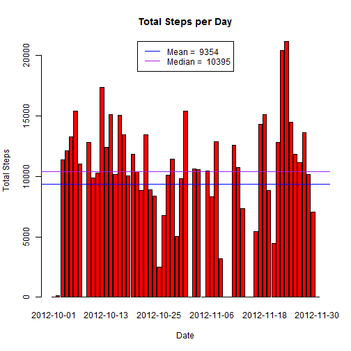
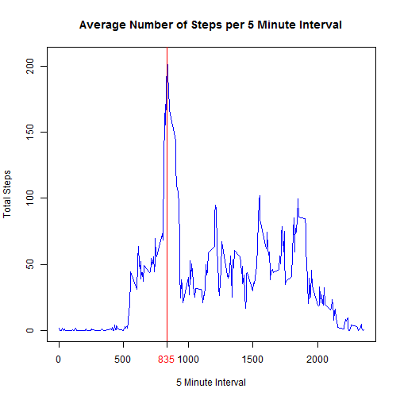
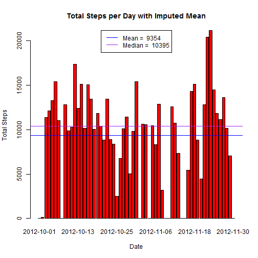
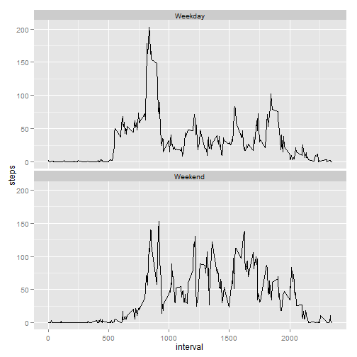

# Reproducible Research: Peer Assessment 1
**Note:** By default echo=TRUE so echo is not explicitly set to TRUE.

## Loading and preprocessing the data
Since the forked GitHub contains the "activity.zip" file, the below script will
check to see if it has already been extracted. If not, we will extract the 
"activity.csv" file to the working directory. The file will be imported into a 
data frame named "activitydata."

```r
if(!file.exists("activity.csv")){
        unzip("activity.zip")
}

activitydata<-read.csv("activity.csv")
```

## What is mean total number of steps taken per day?
To obtain the mean total number of steps per day, the script uses tapply to get
the sum of steps for each day in the study. A bar plot is used to graphically
display the daily totals. Also, ablines are used to indicate the mean and median
of the daily totals. The mean and median values are provided in the legend to
avoid cluttering the y-axis.


```r
daytotals<-tapply(activitydata$steps,activitydata$date,FUN=sum,na.rm=TRUE)

barplot(daytotals,xlab="Date",ylab="Total Steps",col="red",
        main="Total Steps per Day")

abline(h=mean(daytotals),col="blue")
abline(h=median(daytotals),col="purple")

MedianLabel<-paste("Median = ",as.character(round(median(daytotals),
                                                  digits=0)))
MeanLabel<-paste("Mean = ",as.character(round(mean(daytotals),
                                              digits=0)))

legend("top", lwd=1, col = c("blue", "purple"),
       legend = c(MeanLabel, MedianLabel))
```

 

## What is the average daily activity pattern?
To obtain the average number of steps per five minute interval the below script
uses tapply to obtain the mean for each interval across all the days of the 
study. These averages are graphically display using a line plot. Also, the five
minute interval with the maximum average number of steps is indicated by the 
red vertical line.

```r
FiveMinIntAvg<-tapply(activitydata$steps,activitydata$interval,FUN=mean,
                         na.rm=TRUE)

plot(as.numeric(names(FiveMinIntAvg)),FiveMinIntAvg,type="l",
     xlab="5 Minute Interval",ylab="Total Steps",
     col="blue",main="Average Number of Steps per 5 Minute Interval")

MaxInt<-as.numeric(names(FiveMinIntAvg[
        FiveMinIntAvg==max(FiveMinIntAvg,na.rm=TRUE)]))

abline(v=MaxInt,col="red")
axis(1,at=MaxInt,labels=MaxInt,col.axis="red")
```

 

## Imputing missing values


```r
numnas<-sum(is.na(activitydata$steps))
```
The total number of missing values is 2304.

Below the script uses the daily means to impute the missing values using the
replace function and ddply.The modified data set is plotted using a bar plot as
above in the "Total Steps per Day" plot. Using the daily means has no impact as 
compared to removing the NA values (na.rm=TRUE). This seems due to NA values 
being applied only on days that none of the five minute intervals have a value
presumably because the fitness device was not used or was turned off that day.
Therefore, those days have a mean of zero which is essentially the same as 
ignoring the NAs. Imputing the mean of the 5 minute intervals would have a 
different impact as the NAs would take on the mean value of their respective
5 minute interval.

```r
library(plyr)

modactivitydata<-activitydata
impmeans <- function(x) replace(x, is.na(x),mean(x, na.rm = TRUE))
modactivitydata<-ddply(modactivitydata,~ date,transform,steps=impmeans(steps))
modactivitydata$steps[is.nan(modactivitydata$steps)]<-0

impmeandaytotals<-tapply(modactivitydata$steps,modactivitydata$date,FUN=sum,
                         na.rm=TRUE)

barplot(impmeandaytotals,xlab="Date",ylab="Total Steps",col="red",
        main="Total Steps per Day with Imputed Mean")

abline(h=mean(impmeandaytotals),col="blue")
abline(h=median(impmeandaytotals),col="purple")

MedianLabel<-paste("Median = ",as.character(
        round(median(impmeandaytotals),digits=0)))
MeanLabel<-paste("Mean = ",as.character(
        round(mean(impmeandaytotals),digits=0)))

legend("top", lwd=1, col = c("blue", "purple"),
       legend = c(MeanLabel, MedianLabel))
```

 

## Are there differences in activity patterns between weekdays and weekends?
The script below plots the average number of steps per five minute interval for
weekdays and weekends using the modified data set with imputed NA values. An
additional factor is added to the data set to indicate weekdays and weekends
using an ifelse statement and the weekdays() function. The ggplot2 functions 
qplot() and facet_wrap() are then used to plot the average number of steps per 
five minute interval for weekdays and weekends. The subject seems to have a
spike of activity during weekday mornings with less activity later in the day.
On weekends, activity seems to be more spread out throughout the day including
a bit later in the day.

```r
library(ggplot2)

modactivitydata$weekday<-
        ifelse(weekdays(as.POSIXct(modactivitydata$date,format="%Y-%m-%d")) %in%
                       c("Saturday","Sunday"),"Weekend","Weekday")

  p<-qplot(interval,steps,data=modactivitydata,stat="summary",fun.y="mean",
           geom="line")
  p<-p+facet_wrap(~weekday,ncol=1)
  print(p)
```

 

